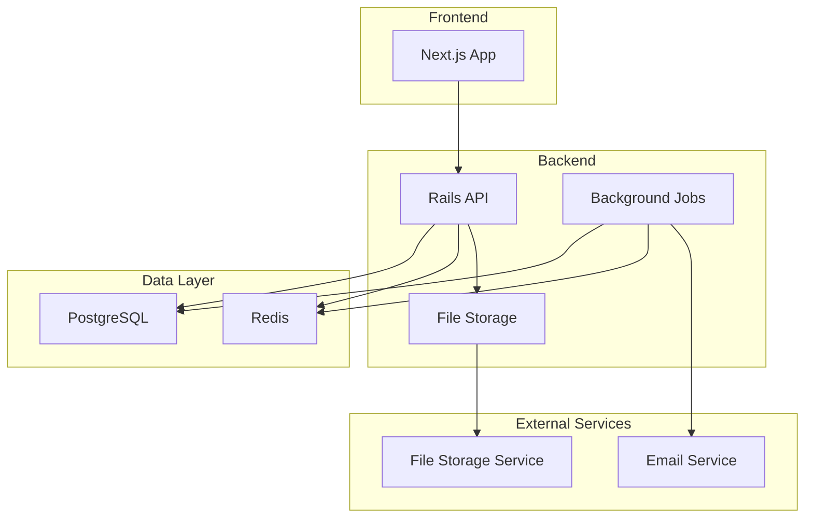
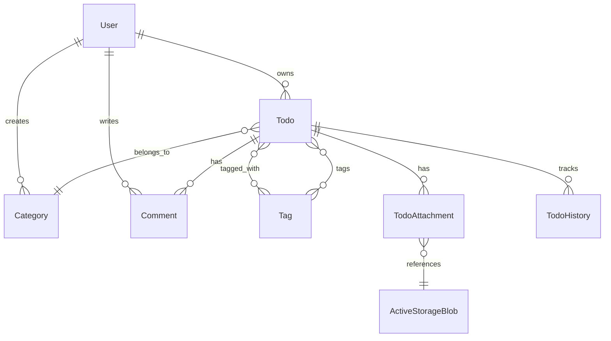

# Design Document

## Overview

リッチ TODO アプリは、現在の基本的な TODO アプリを拡張し、Rails の主要機能を網羅的に学習できるアプリケーションです。マルチユーザー対応、高度な関連付け、バックグラウンド処理、ファイル管理など、実際の Web アプリケーション開発で必要となる機能を実装します。

設計の重点は以下の通りです：

- Rails のベストプラクティスに従った実装
- 学習効果を高めるための豊富なコメントと説明
- スケーラブルで保守性の高いアーキテクチャ
- 実際のプロダクション環境で使用される技術スタックの採用

## Architecture

### システム全体構成



### Rails アプリケーション構成

- **API-first 設計**: フロントエンドとの分離により、将来的なモバイルアプリ対応も可能
- **モジュラー設計**: 機能ごとにモジュールを分離し、保守性を向上
- **サービスオブジェクト**: 複雑なビジネスロジックをコントローラーから分離
- **バックグラウンド処理**: 重い処理やメール送信を非同期で実行

## Components and Interfaces

### 1. 認証・認可システム

**設計決定**: Devise + devise-jwt の組み合わせを採用
**理由**:

- Devise は Rails の標準的な認証ライブラリで、学習効果が高い
- devise-jwt により JWT 認証を統合し、SPA との親和性を確保
- トークン無効化戦略により、セキュアなログアウト機能を実現

#### User Model

```ruby
# app/models/user.rb
class User < ApplicationRecord
  # Deviseモジュールの使用（学習ポイント：Rails標準的な認証gem）
  # devise-jwtモジュールを追加してJWT認証を統合
  devise :database_authenticatable, :registerable,
         :recoverable, :rememberable, :validatable,
         :jwt_authenticatable, jwt_revocation_strategy: JwtDenylist

  # 関連付け（学習ポイント：has_many関連）
  has_many :todos, dependent: :destroy
  has_many :categories, dependent: :destroy
  has_many :comments, dependent: :destroy
  has_many :notification_preferences, dependent: :destroy

  # バリデーション（学習ポイント：カスタムバリデーション）
  validates :name, presence: true, length: { minimum: 2, maximum: 50 }
  validates :email, uniqueness: { case_sensitive: false }

  # 通知設定のデフォルト値を設定
  after_create :create_default_notification_preferences

  private

  def create_default_notification_preferences
    NotificationPreference.create!(
      user: self,
      email_reminders: true,
      reminder_hours_before: 24
    )
  end
end
```

#### Devise-JWT 認証システム

```ruby
# config/initializers/devise.rb
# 学習ポイント：devise-jwtによる統合認証システム
# カスタムJWTサービスの代わりにdevise-jwtを使用することで、
# Deviseの標準機能とJWT認証を統合し、保守性を向上

config.jwt do |jwt|
  jwt.secret = ENV['SECRET_KEY_BASE'] || Rails.application.credentials.secret_key_base
  jwt.dispatch_requests = [
    ['POST', %r{^/auth/sign_in$}],
    ['POST', %r{^/auth/sign_up$}]
  ]
  jwt.revocation_requests = [
    ['DELETE', %r{^/auth/sign_out$}]
  ]
  jwt.expiration_time = 1.day.to_i
end
```

```ruby
# app/models/jwt_denylist.rb
# 学習ポイント：JWTトークンの無効化戦略
# ログアウト時やセキュリティ上の理由でトークンを無効化するための仕組み
class JwtDenylist < ApplicationRecord
  include Devise::JWT::RevocationStrategies::Denylist
  self.table_name = 'jwt_denylists'
end
```

### 2. データモデル設計

#### 主要モデルの関連図



#### Todo Model（拡張版）

```ruby
# app/models/todo.rb
class Todo < ApplicationRecord
  # 関連付け（学習ポイント：様々な関連付けパターン）
  belongs_to :user
  belongs_to :category, optional: true
  has_many :comments, as: :commentable, dependent: :destroy  # polymorphic
  has_many :todo_tags, dependent: :destroy
  has_many :tags, through: :todo_tags  # has_many :through
  has_many :todo_histories, dependent: :destroy
  has_many_attached :attachments  # Active Storage

  # Enum（学習ポイント：enumの活用）
  enum priority: { low: 0, medium: 1, high: 2 }
  enum status: { not_started: 0, in_progress: 1, completed: 2, on_hold: 3 }

  # スコープ（学習ポイント：再利用可能なクエリ）
  scope :due_today, -> { where(due_date: Date.current) }
  scope :overdue, -> { where('due_date < ?', Date.current) }
  scope :by_priority, ->(priority) { where(priority: priority) }

  # コールバック（学習ポイント：ライフサイクルフック）
  before_update :track_changes
  after_update :send_notifications, if: :saved_change_to_status?

  # バリデーション
  validates :title, presence: true, length: { maximum: 255 }
  validates :priority, presence: true
  validates :status, presence: true
  validate :due_date_cannot_be_in_the_past, if: -> { due_date.present? }

  private

  def track_changes
    # 変更履歴の記録（学習ポイント：変更追跡）
  end

  def send_notifications
    # 非同期通知の送信（学習ポイント：Active Job）
    NotificationJob.perform_later(self)
  end
end
```

#### Category Model

```ruby
# app/models/category.rb
class Category < ApplicationRecord
  belongs_to :user
  has_many :todos, dependent: :nullify  # カテゴリ削除時はTODOのカテゴリをnullに

  validates :name, presence: true, uniqueness: { scope: :user_id }
  validates :color, format: { with: /\A#[0-9A-Fa-f]{6}\z/ }  # HEXカラー
end
```

#### Tag Model

```ruby
# app/models/tag.rb
class Tag < ApplicationRecord
  has_many :todo_tags, dependent: :destroy
  has_many :todos, through: :todo_tags

  validates :name, presence: true, uniqueness: true

  # 学習ポイント：正規化されたタグ名の保存
  before_save :normalize_name

  private

  def normalize_name
    self.name = name.strip.downcase
  end
end
```

#### NotificationPreference Model

```ruby
# app/models/notification_preference.rb
class NotificationPreference < ApplicationRecord
  # 学習ポイント：ユーザー設定の管理
  belongs_to :user

  # バリデーション
  validates :reminder_hours_before, presence: true,
            numericality: { greater_than: 0, less_than_or_equal_to: 168 } # 最大1週間前

  # デフォルト値の設定
  after_initialize :set_defaults, if: :new_record?

  private

  def set_defaults
    self.email_reminders ||= true
    self.reminder_hours_before ||= 24
  end
end
```

#### Comment Model（Polymorphic）

```ruby
# app/models/comment.rb
class Comment < ApplicationRecord
  # 学習ポイント：Polymorphic関連付け
  belongs_to :user
  belongs_to :commentable, polymorphic: true

  validates :content, presence: true, length: { maximum: 1000 }

  # ソフトデリート機能（学習ポイント：履歴保持のための論理削除）
  scope :active, -> { where(deleted_at: nil) }
  scope :deleted, -> { where.not(deleted_at: nil) }

  def soft_delete!
    update!(deleted_at: Time.current)
  end

  def deleted?
    deleted_at.present?
  end
end
```

#### TodoHistory Model

```ruby
# app/models/todo_history.rb
class TodoHistory < ApplicationRecord
  # 学習ポイント：変更履歴の追跡
  belongs_to :todo
  belongs_to :user

  validates :field_name, presence: true
  validates :action, presence: true

  enum action: { created: 0, updated: 1, deleted: 2 }

  # 変更内容の可読化
  def human_readable_change
    case field_name
    when 'status'
      "ステータスを「#{old_value}」から「#{new_value}」に変更"
    when 'priority'
      "優先度を「#{old_value}」から「#{new_value}」に変更"
    when 'due_date'
      "期限日を「#{old_value}」から「#{new_value}」に変更"
    else
      "#{field_name}を変更"
    end
  end
end
```

### 3. API 設計

#### RESTful API 構造

```
GET    /api/v1/todos              # 一覧取得（フィルタリング・検索対応）
POST   /api/v1/todos              # 新規作成
GET    /api/v1/todos/:id          # 詳細取得
PATCH  /api/v1/todos/:id          # 更新
DELETE /api/v1/todos/:id          # 削除
PATCH  /api/v1/todos/bulk_update  # 一括更新（並び順など）

GET    /api/v1/categories         # カテゴリ一覧
POST   /api/v1/categories         # カテゴリ作成
PATCH  /api/v1/categories/:id     # カテゴリ更新
DELETE /api/v1/categories/:id     # カテゴリ削除

GET    /api/v1/tags               # タグ一覧
POST   /api/v1/tags               # タグ作成

POST   /api/v1/auth/login         # ログイン
POST   /api/v1/auth/register      # ユーザー登録
DELETE /api/v1/auth/logout        # ログアウト
```

#### JSON API 形式のレスポンス

```ruby
# app/serializers/todo_serializer.rb
class TodoSerializer < ActiveModel::Serializer
  # 学習ポイント：JSON APIの標準化されたレスポンス形式
  attributes :id, :title, :description, :completed, :priority, :status,
             :due_date, :position, :created_at, :updated_at

  belongs_to :category
  has_many :tags
  has_many :comments

  # カスタム属性（学習ポイント：計算されたフィールド）
  attribute :is_overdue do
    object.due_date.present? && object.due_date < Date.current
  end

  attribute :attachment_urls do
    object.attachments.map { |attachment| rails_blob_url(attachment) }
  end
end
```

### 4. バックグラウンド処理

#### Job 設計

```ruby
# app/jobs/notification_job.rb
class NotificationJob < ApplicationJob
  # 学習ポイント：Active Jobによる非同期処理
  queue_as :default

  def perform(todo)
    # メール通知の送信
    TodoMailer.status_changed(todo).deliver_now

    # 将来的な拡張：Slack通知、プッシュ通知など
  end
end

# app/jobs/reminder_job.rb
class ReminderJob < ApplicationJob
  # 学習ポイント：定期実行ジョブ
  def perform
    Todo.due_today.includes(:user).find_each do |todo|
      TodoMailer.reminder(todo).deliver_now
    end
  end
end
```

### 5. ファイル添付システム

**設計決定**: Active Storage を使用したファイル管理
**理由**:

- Rails 標準のファイル管理システムで学習効果が高い
- 自動的な画像リサイズとバリアント生成機能
- セキュアなファイル配信とアクセス制御

#### Active Storage 設定

```ruby
# app/models/todo.rb (ファイル添付部分)
class Todo < ApplicationRecord
  # ファイル添付（学習ポイント：Active Storage）
  has_many_attached :attachments do |attachable|
    attachable.variant :thumb, resize_to_limit: [150, 150]
    attachable.variant :medium, resize_to_limit: [500, 500]
  end

  # ファイル添付のバリデーション
  validate :acceptable_attachments

  private

  def acceptable_attachments
    return unless attachments.attached?

    attachments.each do |attachment|
      unless attachment.blob.byte_size <= 10.megabyte
        errors.add(:attachments, 'ファイルサイズは10MB以下にしてください')
      end

      acceptable_types = %w[image/jpeg image/png image/gif application/pdf text/plain]
      unless acceptable_types.include?(attachment.blob.content_type)
        errors.add(:attachments, 'サポートされていないファイル形式です')
      end
    end
  end
end
```

#### ファイル配信コントローラー

```ruby
# app/controllers/api/v1/attachments_controller.rb
class Api::V1::AttachmentsController < ApplicationController
  # 学習ポイント：セキュアなファイル配信
  before_action :authenticate_user!
  before_action :set_todo
  before_action :set_attachment

  def show
    # ユーザー認証済みの場合のみファイルを配信
    redirect_to rails_blob_url(@attachment, disposition: 'inline')
  end

  def destroy
    @attachment.purge
    head :no_content
  end

  private

  def set_todo
    @todo = current_user.todos.find(params[:todo_id])
  end

  def set_attachment
    @attachment = @todo.attachments.find(params[:id])
  end
end
```

### 6. 通知・メールシステム

**設計決定**: Action Mailer + Active Job による非同期メール配信
**理由**:

- バックグラウンド処理により UI をブロックしない
- 失敗時の再試行機能でメール配信の信頼性を確保
- ユーザー設定に基づく柔軟な通知制御

#### メーラー設計

```ruby
# app/mailers/todo_mailer.rb
class TodoMailer < ApplicationMailer
  # 学習ポイント：Action Mailerによるメール送信

  def reminder(todo)
    @todo = todo
    @user = todo.user

    mail(
      to: @user.email,
      subject: "リマインダー: #{@todo.title}",
      template_path: 'todo_mailer',
      template_name: 'reminder'
    )
  end

  def status_changed(todo)
    @todo = todo
    @user = todo.user

    mail(
      to: @user.email,
      subject: "TODO更新: #{@todo.title}",
      template_path: 'todo_mailer',
      template_name: 'status_changed'
    )
  end

  def overdue_notification(todo)
    @todo = todo
    @user = todo.user

    mail(
      to: @user.email,
      subject: "期限切れ: #{@todo.title}",
      template_path: 'todo_mailer',
      template_name: 'overdue'
    )
  end
end
```

#### 通知ジョブシステム

```ruby
# app/jobs/reminder_job.rb
class ReminderJob < ApplicationJob
  # 学習ポイント：定期実行ジョブとエラーハンドリング
  queue_as :default
  retry_on StandardError, wait: 5.minutes, attempts: 3

  def perform
    # 通知設定が有効なユーザーの期限が近いTODOを取得
    upcoming_todos = Todo.joins(:user, :notification_preferences)
                        .where(notification_preferences: { email_reminders: true })
                        .where('due_date = ?', Date.current + 1.day)
                        .includes(:user)

    upcoming_todos.find_each do |todo|
      TodoMailer.reminder(todo).deliver_now
    end
  end
end

# app/jobs/overdue_check_job.rb
class OverdueCheckJob < ApplicationJob
  queue_as :default

  def perform
    overdue_todos = Todo.joins(:user, :notification_preferences)
                       .where(notification_preferences: { email_reminders: true })
                       .where('due_date < ? AND status != ?', Date.current, 'completed')
                       .includes(:user)

    overdue_todos.find_each do |todo|
      TodoMailer.overdue_notification(todo).deliver_now
    end
  end
end
```

### 7. 検索・フィルタリングシステム

**設計決定**: サービスオブジェクトによる複雑な検索ロジックの分離
**理由**:

- コントローラーの責務を明確に分離
- 複雑な検索条件の組み合わせを効率的に処理
- テスタビリティの向上

#### 高度な検索サービス

```ruby
# app/services/todo_search_service.rb
class TodoSearchService
  # 学習ポイント：複雑な検索ロジックのサービス化

  def initialize(user, params = {})
    @user = user
    @params = params
  end

  def call
    todos = @user.todos.includes(:category, :tags, :comments)
    todos = apply_text_search(todos)
    todos = apply_filters(todos)
    todos = apply_date_filters(todos)
    todos = apply_sorting(todos)
    paginate_results(todos)
  end

  private

  def apply_text_search(todos)
    return todos unless @params[:q].present?

    # 学習ポイント：PostgreSQLの全文検索機能
    search_term = "%#{@params[:q]}%"
    todos.where("title ILIKE ? OR description ILIKE ?", search_term, search_term)
  end

  def apply_filters(todos)
    todos = todos.where(category_id: @params[:category_id]) if @params[:category_id].present?
    todos = todos.where(status: @params[:status]) if @params[:status].present?
    todos = todos.where(priority: @params[:priority]) if @params[:priority].present?

    if @params[:tag_ids].present?
      todos = todos.joins(:tags).where(tags: { id: @params[:tag_ids] })
    end

    todos
  end

  def apply_date_filters(todos)
    if @params[:due_date_from].present?
      todos = todos.where('due_date >= ?', @params[:due_date_from])
    end

    if @params[:due_date_to].present?
      todos = todos.where('due_date <= ?', @params[:due_date_to])
    end

    case @params[:due_status]
    when 'overdue'
      todos = todos.where('due_date < ?', Date.current)
    when 'due_today'
      todos = todos.where(due_date: Date.current)
    when 'due_this_week'
      todos = todos.where(due_date: Date.current..Date.current.end_of_week)
    end

    todos
  end

  def apply_sorting(todos)
    case @params[:sort_by]
    when 'due_date'
      todos.order(:due_date)
    when 'priority'
      todos.order(:priority)
    when 'created_at'
      todos.order(:created_at)
    else
      todos.order(:position, :created_at)
    end
  end

  def paginate_results(todos)
    page = @params[:page]&.to_i || 1
    per_page = [@params[:per_page]&.to_i || 20, 100].min # 最大100件まで

    todos.offset((page - 1) * per_page).limit(per_page)
  end
end
```

### 8. API バージョニングと改善

**設計決定**: URL ベースのバージョニングと JSON API 仕様の採用
**理由**:

- 明確なバージョン管理により後方互換性を確保
- JSON API 仕様により一貫したレスポンス形式を提供
- 開発者体験の向上と API 利用の簡素化

#### API バージョニング戦略

```ruby
# config/routes.rb
Rails.application.routes.draw do
  namespace :api do
    namespace :v1 do
      # 現在のAPIエンドポイント
      resources :todos do
        resources :comments, only: [:index, :create, :destroy]
        resources :attachments, only: [:show, :destroy]
        collection do
          patch :bulk_update
          get :search
        end
      end
      resources :categories
      resources :tags, only: [:index, :create]
    end

    # 将来のバージョン対応
    namespace :v2 do
      # 新しいAPIバージョンのエンドポイント
    end
  end
end
```

#### 統一された API レスポンス形式

```ruby
# app/controllers/concerns/api_response_formatter.rb
module ApiResponseFormatter
  extend ActiveSupport::Concern

  private

  def render_success(data, status: :ok, meta: {})
    render json: {
      data: data,
      meta: meta,
      status: 'success'
    }, status: status
  end

  def render_error(message, status: :bad_request, details: [])
    render json: {
      error: {
        message: message,
        details: details
      },
      status: 'error'
    }, status: status
  end

  def render_paginated(collection, serializer_class, meta: {})
    render json: {
      data: ActiveModelSerializers::SerializableResource.new(
        collection,
        each_serializer: serializer_class
      ),
      meta: pagination_meta(collection).merge(meta),
      status: 'success'
    }
  end

  def pagination_meta(collection)
    {
      current_page: collection.current_page,
      per_page: collection.limit_value,
      total_pages: collection.total_pages,
      total_count: collection.total_count
    }
  end
end
```

### 9. パフォーマンス最適化

**設計決定**: 多層キャッシュ戦略とクエリ最適化
**理由**:

- N+1 クエリ問題の解決により応答時間を大幅改善
- Redis キャッシュにより頻繁にアクセスされるデータの高速化
- 適切なインデックス設計によりデータベースパフォーマンスを向上

#### クエリ最適化戦略

```ruby
# app/controllers/api/v1/todos_controller.rb
class Api::V1::TodosController < ApplicationController
  def index
    # N+1クエリを避けるための適切なincludesの使用
    @todos = current_user.todos
                        .includes(:category, :tags, :comments, attachments_attachments: :blob)
                        .order(:position, :created_at)

    # 検索・フィルタリングの適用
    @todos = TodoSearchService.new(current_user, search_params).call

    render_paginated(@todos, TodoSerializer)
  end

  def show
    # 詳細表示時の関連データの効率的な読み込み
    @todo = current_user.todos
                       .includes(:category, :tags,
                                comments: :user,
                                todo_histories: :user,
                                attachments_attachments: :blob)
                       .find(params[:id])

    render_success(@todo, serializer: TodoSerializer)
  end
end
```

#### キャッシュ戦略

```ruby
# app/models/concerns/cacheable.rb
module Cacheable
  extend ActiveSupport::Concern

  included do
    after_update :expire_cache
    after_destroy :expire_cache
  end

  def cache_key_with_version
    "#{model_name.cache_key}/#{id}-#{updated_at.to_i}"
  end

  private

  def expire_cache
    Rails.cache.delete_matched("#{model_name.cache_key}/#{id}-*")
  end
end

# app/models/todo.rb (キャッシュ機能追加)
class Todo < ApplicationRecord
  include Cacheable

  # 頻繁にアクセスされる統計情報のキャッシュ
  def self.stats_for_user(user)
    Rails.cache.fetch("user_#{user.id}_todo_stats", expires_in: 1.hour) do
      {
        total: user.todos.count,
        completed: user.todos.completed.count,
        overdue: user.todos.overdue.count,
        due_today: user.todos.due_today.count
      }
    end
  end
end
```

#### データベースインデックス最適化

```sql
-- 複合インデックスによる検索性能向上
CREATE INDEX idx_todos_user_status_priority ON todos(user_id, status, priority);
CREATE INDEX idx_todos_user_due_date ON todos(user_id, due_date) WHERE due_date IS NOT NULL;
CREATE INDEX idx_todos_user_category ON todos(user_id, category_id) WHERE category_id IS NOT NULL;

-- 全文検索用のインデックス（PostgreSQL）
CREATE INDEX idx_todos_search ON todos USING gin(to_tsvector('japanese', title || ' ' || COALESCE(description, '')));

-- 部分インデックスによる効率化
CREATE INDEX idx_active_todos ON todos(user_id, created_at) WHERE status != 2; -- 完了以外
CREATE INDEX idx_overdue_todos ON todos(user_id, due_date) WHERE due_date < CURRENT_DATE AND status != 2;
```

### 10. 品質管理とモニタリング

**設計決定**: 包括的なテスト戦略と継続的品質管理
**理由**:

- 高いテストカバレッジにより品質を保証
- 自動化されたコード品質チェックにより一貫性を確保
- パフォーマンスモニタリングにより問題の早期発見

#### テスト戦略の詳細設計

```ruby
# spec/support/shared_examples/api_authentication.rb
RSpec.shared_examples 'requires authentication' do
  context 'when user is not authenticated' do
    it 'returns 401 unauthorized' do
      subject
      expect(response).to have_http_status(:unauthorized)
      expect(json_response['error']['type']).to eq('authentication_error')
    end
  end
end

# spec/support/shared_examples/api_pagination.rb
RSpec.shared_examples 'paginatable endpoint' do
  it 'includes pagination metadata' do
    subject
    expect(json_response['meta']).to include(
      'current_page',
      'per_page',
      'total_pages',
      'total_count'
    )
  end

  it 'respects per_page parameter' do
    get endpoint_path, params: { per_page: 5 }
    expect(json_response['data'].length).to be <= 5
  end
end
```

#### パフォーマンステスト

```ruby
# spec/performance/todos_performance_spec.rb
RSpec.describe 'Todos API Performance', type: :request do
  let(:user) { create(:user) }
  let!(:todos) { create_list(:todo, 100, :with_category, :with_tags, user: user) }

  before { sign_in user }

  it 'loads todos index within acceptable time' do
    expect {
      get '/api/v1/todos'
    }.to perform_under(500).ms
  end

  it 'avoids N+1 queries when loading todos with associations' do
    expect {
      get '/api/v1/todos'
    }.to perform_constant_number_of_queries
  end
end
```

#### コード品質設定

```ruby
# .rubocop.yml
AllCops:
  TargetRubyVersion: 3.1
  NewCops: enable
  Exclude:
    - 'db/schema.rb'
    - 'db/migrate/*'
    - 'vendor/**/*'
    - 'node_modules/**/*'

Metrics/ClassLength:
  Max: 150
  Exclude:
    - 'spec/**/*'

Metrics/MethodLength:
  Max: 20
  Exclude:
    - 'spec/**/*'

Style/Documentation:
  Enabled: false

Rails/FilePath:
  Enabled: false
```

#### アプリケーションモニタリング

```ruby
# app/controllers/concerns/performance_monitoring.rb
module PerformanceMonitoring
  extend ActiveSupport::Concern

  included do
    around_action :monitor_performance
  end

  private

  def monitor_performance
    start_time = Time.current
    yield
  ensure
    duration = Time.current - start_time

    if duration > 1.second
      Rails.logger.warn "Slow request: #{request.method} #{request.path} took #{duration}s"

      # 本番環境では外部監視サービスに送信
      if Rails.env.production?
        # NewRelic, DataDog, Sentryなどへの送信
      end
    end
  end
end

# app/controllers/api/v1/health_controller.rb
class Api::V1::HealthController < ApplicationController
  skip_before_action :authenticate_user!

  def show
    health_status = {
      status: 'healthy',
      timestamp: Time.current.iso8601,
      version: Rails.application.config.version,
      database: database_healthy?,
      redis: redis_healthy?,
      storage: storage_healthy?
    }

    render json: health_status
  end

  private

  def database_healthy?
    ActiveRecord::Base.connection.execute('SELECT 1')
    true
  rescue
    false
  end

  def redis_healthy?
    Rails.cache.redis.ping == 'PONG'
  rescue
    false
  end

  def storage_healthy?
    ActiveStorage::Blob.service.exist?('health_check')
  rescue
    false
  end
end
```

## Data Models

### データベーススキーマ設計

```sql
-- Users table
CREATE TABLE users (
  id BIGSERIAL PRIMARY KEY,
  email VARCHAR NOT NULL UNIQUE,
  encrypted_password VARCHAR NOT NULL,
  name VARCHAR NOT NULL,
  created_at TIMESTAMP NOT NULL,
  updated_at TIMESTAMP NOT NULL
);

-- Categories table
CREATE TABLE categories (
  id BIGSERIAL PRIMARY KEY,
  user_id BIGINT NOT NULL REFERENCES users(id),
  name VARCHAR NOT NULL,
  color VARCHAR(7) DEFAULT '#3B82F6',
  created_at TIMESTAMP NOT NULL,
  updated_at TIMESTAMP NOT NULL,
  UNIQUE(user_id, name)
);

-- Tags table
CREATE TABLE tags (
  id BIGSERIAL PRIMARY KEY,
  name VARCHAR NOT NULL UNIQUE,
  created_at TIMESTAMP NOT NULL,
  updated_at TIMESTAMP NOT NULL
);

-- Todos table (extended)
CREATE TABLE todos (
  id BIGSERIAL PRIMARY KEY,
  user_id BIGINT NOT NULL REFERENCES users(id),
  category_id BIGINT REFERENCES categories(id),
  title VARCHAR NOT NULL,
  description TEXT,
  completed BOOLEAN DEFAULT FALSE,
  priority INTEGER DEFAULT 1, -- 0: low, 1: medium, 2: high
  status INTEGER DEFAULT 0,   -- 0: not_started, 1: in_progress, 2: completed, 3: on_hold
  due_date DATE,
  position INTEGER,
  created_at TIMESTAMP NOT NULL,
  updated_at TIMESTAMP NOT NULL
);

-- Todo-Tag junction table
CREATE TABLE todo_tags (
  id BIGSERIAL PRIMARY KEY,
  todo_id BIGINT NOT NULL REFERENCES todos(id),
  tag_id BIGINT NOT NULL REFERENCES tags(id),
  created_at TIMESTAMP NOT NULL,
  UNIQUE(todo_id, tag_id)
);

-- Comments table (polymorphic)
CREATE TABLE comments (
  id BIGSERIAL PRIMARY KEY,
  user_id BIGINT NOT NULL REFERENCES users(id),
  commentable_type VARCHAR NOT NULL,
  commentable_id BIGINT NOT NULL,
  content TEXT NOT NULL,
  created_at TIMESTAMP NOT NULL,
  updated_at TIMESTAMP NOT NULL
);

-- Todo histories table
CREATE TABLE todo_histories (
  id BIGSERIAL PRIMARY KEY,
  todo_id BIGINT NOT NULL REFERENCES todos(id),
  user_id BIGINT NOT NULL REFERENCES users(id),
  field_name VARCHAR NOT NULL,
  old_value TEXT,
  new_value TEXT,
  created_at TIMESTAMP NOT NULL
);
```

### インデックス設計

```sql
-- パフォーマンス最適化のためのインデックス
CREATE INDEX idx_todos_user_id ON todos(user_id);
CREATE INDEX idx_todos_due_date ON todos(due_date);
CREATE INDEX idx_todos_status ON todos(status);
CREATE INDEX idx_todos_priority ON todos(priority);
CREATE INDEX idx_todos_position ON todos(position);
CREATE INDEX idx_comments_commentable ON comments(commentable_type, commentable_id);
CREATE INDEX idx_todo_histories_todo_id ON todo_histories(todo_id);
```

## Error Handling

### 統一されたエラーハンドリング

```ruby
# app/controllers/application_controller.rb
class ApplicationController < ActionController::API
  # 学習ポイント：統一されたエラーハンドリング

  rescue_from ActiveRecord::RecordNotFound, with: :record_not_found
  rescue_from ActiveRecord::RecordInvalid, with: :record_invalid
  rescue_from JWT::DecodeError, with: :unauthorized

  private

  def record_not_found(exception)
    render json: {
      error: {
        type: 'record_not_found',
        message: exception.message
      }
    }, status: :not_found
  end

  def record_invalid(exception)
    render json: {
      error: {
        type: 'validation_error',
        message: 'Validation failed',
        details: exception.record.errors.full_messages
      }
    }, status: :unprocessable_entity
  end
end
```

### カスタム例外クラス

```ruby
# app/exceptions/application_error.rb
class ApplicationError < StandardError
  # 学習ポイント：カスタム例外の設計
  attr_reader :status, :error_type

  def initialize(message, status: :internal_server_error, error_type: 'application_error')
    super(message)
    @status = status
    @error_type = error_type
  end
end

class AuthenticationError < ApplicationError
  def initialize(message = 'Authentication failed')
    super(message, status: :unauthorized, error_type: 'authentication_error')
  end
end
```

## Testing Strategy

### テスト構成

```ruby
# spec/rails_helper.rb
# 学習ポイント：RSpecの設定とベストプラクティス

RSpec.configure do |config|
  # Factory Botの設定
  config.include FactoryBot::Syntax::Methods

  # データベースクリーナーの設定
  config.use_transactional_fixtures = true

  # 共通のヘルパーメソッド
  config.include AuthenticationHelpers, type: :request
end
```

### テストファクトリー

```ruby
# spec/factories/users.rb
FactoryBot.define do
  factory :user do
    sequence(:email) { |n| "user#{n}@example.com" }
    password { 'password123' }
    name { 'Test User' }

    trait :with_todos do
      after(:create) do |user|
        create_list(:todo, 3, user: user)
      end
    end
  end
end

# spec/factories/todos.rb
FactoryBot.define do
  factory :todo do
    association :user
    title { 'Sample Todo' }
    description { 'This is a sample todo item' }
    priority { :medium }
    status { :not_started }

    trait :with_category do
      association :category
    end

    trait :with_tags do
      after(:create) do |todo|
        todo.tags << create_list(:tag, 2)
      end
    end
  end
end
```

### テストケース例

```ruby
# spec/models/todo_spec.rb
RSpec.describe Todo, type: :model do
  # 学習ポイント：モデルテストのベストプラクティス

  describe 'associations' do
    it { should belong_to(:user) }
    it { should belong_to(:category).optional }
    it { should have_many(:comments) }
    it { should have_many(:tags).through(:todo_tags) }
  end

  describe 'validations' do
    it { should validate_presence_of(:title) }
    it { should validate_length_of(:title).is_at_most(255) }
  end

  describe 'scopes' do
    let!(:overdue_todo) { create(:todo, due_date: 1.day.ago) }
    let!(:today_todo) { create(:todo, due_date: Date.current) }

    it 'returns overdue todos' do
      expect(Todo.overdue).to include(overdue_todo)
      expect(Todo.overdue).not_to include(today_todo)
    end
  end
end
```

この設計により、Rails の主要機能を体系的に学習できる構成になっています。各機能の実装時には、豊富なコメントと説明を含めて、学習効果を最大化します。
