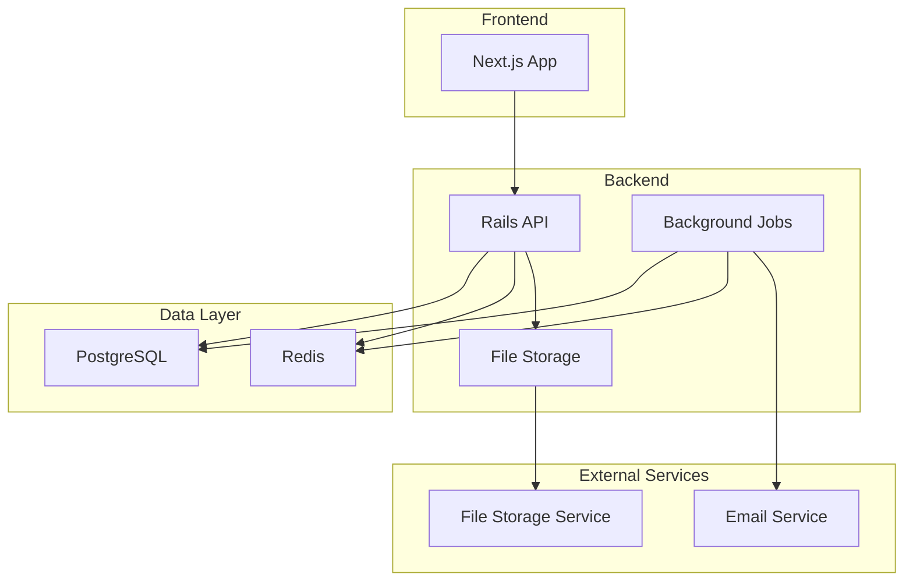
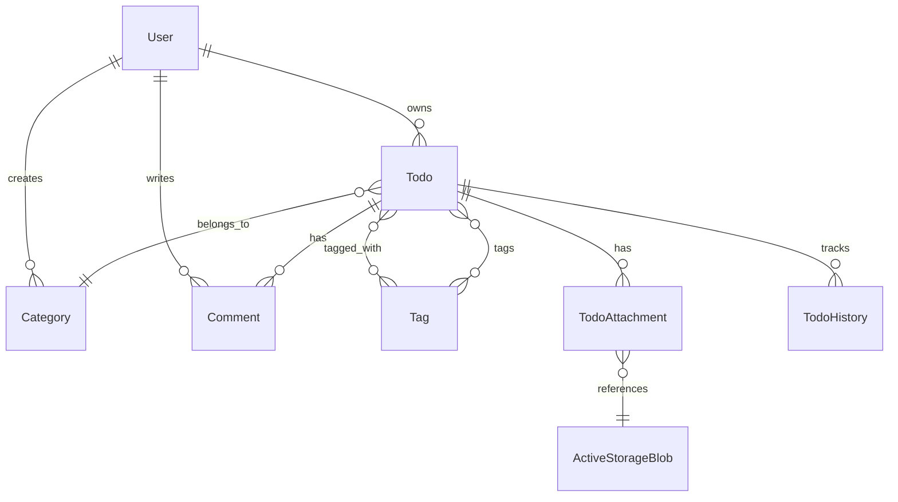

# Design Document

## Overview

リッチTODOアプリは、現在の基本的なTODOアプリを拡張し、Railsの主要機能を網羅的に学習できるアプリケーションです。マルチユーザー対応、高度な関連付け、バックグラウンド処理、ファイル管理など、実際のWebアプリケーション開発で必要となる機能を実装します。

設計の重点は以下の通りです：
- Railsのベストプラクティスに従った実装
- 学習効果を高めるための豊富なコメントと説明
- スケーラブルで保守性の高いアーキテクチャ
- 実際のプロダクション環境で使用される技術スタックの採用

## Architecture

### システム全体構成



### Rails アプリケーション構成

- **API-first設計**: フロントエンドとの分離により、将来的なモバイルアプリ対応も可能
- **モジュラー設計**: 機能ごとにモジュールを分離し、保守性を向上
- **サービスオブジェクト**: 複雑なビジネスロジックをコントローラーから分離
- **バックグラウンド処理**: 重い処理やメール送信を非同期で実行

## Components and Interfaces

### 1. 認証・認可システム

#### User Model
```ruby
# app/models/user.rb
class User < ApplicationRecord
  # Deviseモジュールの使用（学習ポイント：Rails標準的な認証gem）
  devise :database_authenticatable, :registerable,
         :recoverable, :rememberable, :validatable
  
  # 関連付け（学習ポイント：has_many関連）
  has_many :todos, dependent: :destroy
  has_many :categories, dependent: :destroy
  has_many :comments, dependent: :destroy
  
  # バリデーション（学習ポイント：カスタムバリデーション）
  validates :name, presence: true, length: { minimum: 2, maximum: 50 }
  validates :email, uniqueness: { case_sensitive: false }
end
```

#### JWT認証サービス
```ruby
# app/services/jwt_service.rb
class JwtService
  # 学習ポイント：サービスオブジェクトパターン
  # 複雑なロジックをモデルやコントローラーから分離
  
  SECRET_KEY = Rails.application.credentials.secret_key_base
  
  def self.encode(payload, exp = 24.hours.from_now)
    # JWTトークンの生成ロジック
  end
  
  def self.decode(token)
    # JWTトークンの検証・デコードロジック
  end
end
```

### 2. データモデル設計

#### 主要モデルの関連図


#### Todo Model（拡張版）
```ruby
# app/models/todo.rb
class Todo < ApplicationRecord
  # 関連付け（学習ポイント：様々な関連付けパターン）
  belongs_to :user
  belongs_to :category, optional: true
  has_many :comments, as: :commentable, dependent: :destroy  # polymorphic
  has_many :todo_tags, dependent: :destroy
  has_many :tags, through: :todo_tags  # has_many :through
  has_many :todo_histories, dependent: :destroy
  has_many_attached :attachments  # Active Storage
  
  # Enum（学習ポイント：enumの活用）
  enum priority: { low: 0, medium: 1, high: 2 }
  enum status: { not_started: 0, in_progress: 1, completed: 2, on_hold: 3 }
  
  # スコープ（学習ポイント：再利用可能なクエリ）
  scope :due_today, -> { where(due_date: Date.current) }
  scope :overdue, -> { where('due_date < ?', Date.current) }
  scope :by_priority, ->(priority) { where(priority: priority) }
  
  # コールバック（学習ポイント：ライフサイクルフック）
  before_update :track_changes
  after_update :send_notifications, if: :saved_change_to_status?
  
  # バリデーション
  validates :title, presence: true, length: { maximum: 255 }
  validates :priority, presence: true
  validates :status, presence: true
  validate :due_date_cannot_be_in_the_past, if: -> { due_date.present? }
  
  private
  
  def track_changes
    # 変更履歴の記録（学習ポイント：変更追跡）
  end
  
  def send_notifications
    # 非同期通知の送信（学習ポイント：Active Job）
    NotificationJob.perform_later(self)
  end
end
```

#### Category Model
```ruby
# app/models/category.rb
class Category < ApplicationRecord
  belongs_to :user
  has_many :todos, dependent: :nullify  # カテゴリ削除時はTODOのカテゴリをnullに
  
  validates :name, presence: true, uniqueness: { scope: :user_id }
  validates :color, format: { with: /\A#[0-9A-Fa-f]{6}\z/ }  # HEXカラー
end
```

#### Tag Model
```ruby
# app/models/tag.rb
class Tag < ApplicationRecord
  has_many :todo_tags, dependent: :destroy
  has_many :todos, through: :todo_tags
  
  validates :name, presence: true, uniqueness: true
  
  # 学習ポイント：正規化されたタグ名の保存
  before_save :normalize_name
  
  private
  
  def normalize_name
    self.name = name.strip.downcase
  end
end
```

### 3. API設計

#### RESTful API構造
```
GET    /api/v1/todos              # 一覧取得（フィルタリング・検索対応）
POST   /api/v1/todos              # 新規作成
GET    /api/v1/todos/:id          # 詳細取得
PATCH  /api/v1/todos/:id          # 更新
DELETE /api/v1/todos/:id          # 削除
PATCH  /api/v1/todos/bulk_update  # 一括更新（並び順など）

GET    /api/v1/categories         # カテゴリ一覧
POST   /api/v1/categories         # カテゴリ作成
PATCH  /api/v1/categories/:id     # カテゴリ更新
DELETE /api/v1/categories/:id     # カテゴリ削除

GET    /api/v1/tags               # タグ一覧
POST   /api/v1/tags               # タグ作成

POST   /api/v1/auth/login         # ログイン
POST   /api/v1/auth/register      # ユーザー登録
DELETE /api/v1/auth/logout        # ログアウト
```

#### JSON API形式のレスポンス
```ruby
# app/serializers/todo_serializer.rb
class TodoSerializer < ActiveModel::Serializer
  # 学習ポイント：JSON APIの標準化されたレスポンス形式
  attributes :id, :title, :description, :completed, :priority, :status,
             :due_date, :position, :created_at, :updated_at
  
  belongs_to :category
  has_many :tags
  has_many :comments
  
  # カスタム属性（学習ポイント：計算されたフィールド）
  attribute :is_overdue do
    object.due_date.present? && object.due_date < Date.current
  end
  
  attribute :attachment_urls do
    object.attachments.map { |attachment| rails_blob_url(attachment) }
  end
end
```

### 4. バックグラウンド処理

#### Job設計
```ruby
# app/jobs/notification_job.rb
class NotificationJob < ApplicationJob
  # 学習ポイント：Active Jobによる非同期処理
  queue_as :default
  
  def perform(todo)
    # メール通知の送信
    TodoMailer.status_changed(todo).deliver_now
    
    # 将来的な拡張：Slack通知、プッシュ通知など
  end
end

# app/jobs/reminder_job.rb
class ReminderJob < ApplicationJob
  # 学習ポイント：定期実行ジョブ
  def perform
    Todo.due_today.includes(:user).find_each do |todo|
      TodoMailer.reminder(todo).deliver_now
    end
  end
end
```

### 5. 検索・フィルタリング

#### 検索サービス
```ruby
# app/services/todo_search_service.rb
class TodoSearchService
  # 学習ポイント：複雑な検索ロジックのサービス化
  
  def initialize(user, params = {})
    @user = user
    @params = params
  end
  
  def call
    todos = @user.todos.includes(:category, :tags, :comments)
    todos = apply_text_search(todos)
    todos = apply_filters(todos)
    todos = apply_sorting(todos)
    todos
  end
  
  private
  
  def apply_text_search(todos)
    return todos unless @params[:q].present?
    
    # 学習ポイント：PostgreSQLの全文検索機能
    todos.where("title ILIKE ? OR description ILIKE ?", 
                "%#{@params[:q]}%", "%#{@params[:q]}%")
  end
  
  def apply_filters(todos)
    # カテゴリ、ステータス、優先度、期限日でのフィルタリング
  end
end
```

## Data Models

### データベーススキーマ設計

```sql
-- Users table
CREATE TABLE users (
  id BIGSERIAL PRIMARY KEY,
  email VARCHAR NOT NULL UNIQUE,
  encrypted_password VARCHAR NOT NULL,
  name VARCHAR NOT NULL,
  created_at TIMESTAMP NOT NULL,
  updated_at TIMESTAMP NOT NULL
);

-- Categories table
CREATE TABLE categories (
  id BIGSERIAL PRIMARY KEY,
  user_id BIGINT NOT NULL REFERENCES users(id),
  name VARCHAR NOT NULL,
  color VARCHAR(7) DEFAULT '#3B82F6',
  created_at TIMESTAMP NOT NULL,
  updated_at TIMESTAMP NOT NULL,
  UNIQUE(user_id, name)
);

-- Tags table
CREATE TABLE tags (
  id BIGSERIAL PRIMARY KEY,
  name VARCHAR NOT NULL UNIQUE,
  created_at TIMESTAMP NOT NULL,
  updated_at TIMESTAMP NOT NULL
);

-- Todos table (extended)
CREATE TABLE todos (
  id BIGSERIAL PRIMARY KEY,
  user_id BIGINT NOT NULL REFERENCES users(id),
  category_id BIGINT REFERENCES categories(id),
  title VARCHAR NOT NULL,
  description TEXT,
  completed BOOLEAN DEFAULT FALSE,
  priority INTEGER DEFAULT 1, -- 0: low, 1: medium, 2: high
  status INTEGER DEFAULT 0,   -- 0: not_started, 1: in_progress, 2: completed, 3: on_hold
  due_date DATE,
  position INTEGER,
  created_at TIMESTAMP NOT NULL,
  updated_at TIMESTAMP NOT NULL
);

-- Todo-Tag junction table
CREATE TABLE todo_tags (
  id BIGSERIAL PRIMARY KEY,
  todo_id BIGINT NOT NULL REFERENCES todos(id),
  tag_id BIGINT NOT NULL REFERENCES tags(id),
  created_at TIMESTAMP NOT NULL,
  UNIQUE(todo_id, tag_id)
);

-- Comments table (polymorphic)
CREATE TABLE comments (
  id BIGSERIAL PRIMARY KEY,
  user_id BIGINT NOT NULL REFERENCES users(id),
  commentable_type VARCHAR NOT NULL,
  commentable_id BIGINT NOT NULL,
  content TEXT NOT NULL,
  created_at TIMESTAMP NOT NULL,
  updated_at TIMESTAMP NOT NULL
);

-- Todo histories table
CREATE TABLE todo_histories (
  id BIGSERIAL PRIMARY KEY,
  todo_id BIGINT NOT NULL REFERENCES todos(id),
  user_id BIGINT NOT NULL REFERENCES users(id),
  field_name VARCHAR NOT NULL,
  old_value TEXT,
  new_value TEXT,
  created_at TIMESTAMP NOT NULL
);
```

### インデックス設計
```sql
-- パフォーマンス最適化のためのインデックス
CREATE INDEX idx_todos_user_id ON todos(user_id);
CREATE INDEX idx_todos_due_date ON todos(due_date);
CREATE INDEX idx_todos_status ON todos(status);
CREATE INDEX idx_todos_priority ON todos(priority);
CREATE INDEX idx_todos_position ON todos(position);
CREATE INDEX idx_comments_commentable ON comments(commentable_type, commentable_id);
CREATE INDEX idx_todo_histories_todo_id ON todo_histories(todo_id);
```

## Error Handling

### 統一されたエラーハンドリング
```ruby
# app/controllers/application_controller.rb
class ApplicationController < ActionController::API
  # 学習ポイント：統一されたエラーハンドリング
  
  rescue_from ActiveRecord::RecordNotFound, with: :record_not_found
  rescue_from ActiveRecord::RecordInvalid, with: :record_invalid
  rescue_from JWT::DecodeError, with: :unauthorized
  
  private
  
  def record_not_found(exception)
    render json: {
      error: {
        type: 'record_not_found',
        message: exception.message
      }
    }, status: :not_found
  end
  
  def record_invalid(exception)
    render json: {
      error: {
        type: 'validation_error',
        message: 'Validation failed',
        details: exception.record.errors.full_messages
      }
    }, status: :unprocessable_entity
  end
end
```

### カスタム例外クラス
```ruby
# app/exceptions/application_error.rb
class ApplicationError < StandardError
  # 学習ポイント：カスタム例外の設計
  attr_reader :status, :error_type
  
  def initialize(message, status: :internal_server_error, error_type: 'application_error')
    super(message)
    @status = status
    @error_type = error_type
  end
end

class AuthenticationError < ApplicationError
  def initialize(message = 'Authentication failed')
    super(message, status: :unauthorized, error_type: 'authentication_error')
  end
end
```

## Testing Strategy

### テスト構成
```ruby
# spec/rails_helper.rb
# 学習ポイント：RSpecの設定とベストプラクティス

RSpec.configure do |config|
  # Factory Botの設定
  config.include FactoryBot::Syntax::Methods
  
  # データベースクリーナーの設定
  config.use_transactional_fixtures = true
  
  # 共通のヘルパーメソッド
  config.include AuthenticationHelpers, type: :request
end
```

### テストファクトリー
```ruby
# spec/factories/users.rb
FactoryBot.define do
  factory :user do
    sequence(:email) { |n| "user#{n}@example.com" }
    password { 'password123' }
    name { 'Test User' }
    
    trait :with_todos do
      after(:create) do |user|
        create_list(:todo, 3, user: user)
      end
    end
  end
end

# spec/factories/todos.rb
FactoryBot.define do
  factory :todo do
    association :user
    title { 'Sample Todo' }
    description { 'This is a sample todo item' }
    priority { :medium }
    status { :not_started }
    
    trait :with_category do
      association :category
    end
    
    trait :with_tags do
      after(:create) do |todo|
        todo.tags << create_list(:tag, 2)
      end
    end
  end
end
```

### テストケース例
```ruby
# spec/models/todo_spec.rb
RSpec.describe Todo, type: :model do
  # 学習ポイント：モデルテストのベストプラクティス
  
  describe 'associations' do
    it { should belong_to(:user) }
    it { should belong_to(:category).optional }
    it { should have_many(:comments) }
    it { should have_many(:tags).through(:todo_tags) }
  end
  
  describe 'validations' do
    it { should validate_presence_of(:title) }
    it { should validate_length_of(:title).is_at_most(255) }
  end
  
  describe 'scopes' do
    let!(:overdue_todo) { create(:todo, due_date: 1.day.ago) }
    let!(:today_todo) { create(:todo, due_date: Date.current) }
    
    it 'returns overdue todos' do
      expect(Todo.overdue).to include(overdue_todo)
      expect(Todo.overdue).not_to include(today_todo)
    end
  end
end
```

この設計により、Railsの主要機能を体系的に学習できる構成になっています。各機能の実装時には、豊富なコメントと説明を含めて、学習効果を最大化します。