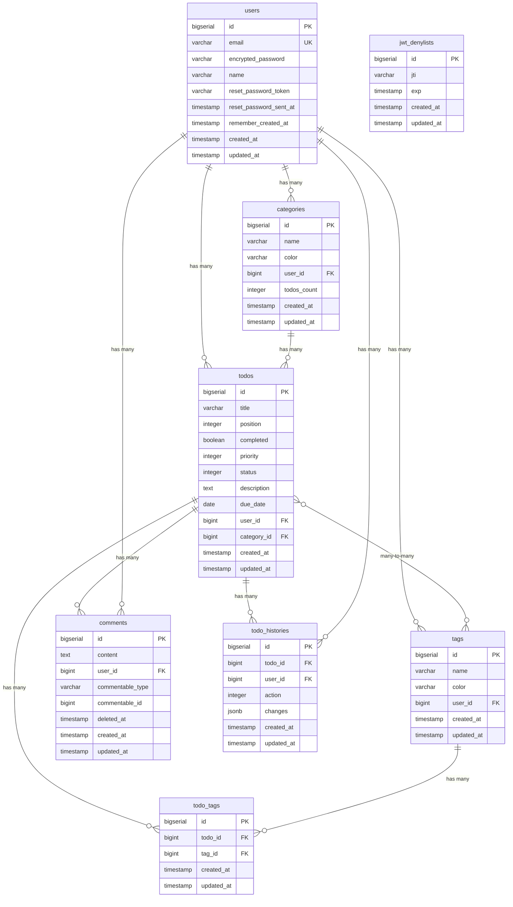

# Database Architecture

## Overview

- **Database System**: PostgreSQL 15
- **ORM**: ActiveRecord (Rails)
- **Migrations**: Rails migrations for schema management
- **Container**: Runs in Docker with persistent volume

## Entity Relationship Diagram



### 主要な関係性

1. **User → Todos**: 1対多の関係。各ユーザーは複数のTodoを持つ
2. **User → Categories**: 1対多の関係。各ユーザーは複数のカテゴリーを持つ
3. **User → Tags**: 1対多の関係。各ユーザーは複数のタグを持つ
4. **Category → Todos**: 1対多の関係。各カテゴリーは複数のTodoを含む（オプション）
5. **Todo ↔ Tags**: 多対多の関係。TodoTagsテーブルを介して実現
   - 1つのTodoは複数のタグを持てる
   - 1つのタグは複数のTodoに付けられる
6. **Todo → Comments**: 1対多の関係（ポリモーフィック）。各Todoは複数のコメントを持つ
7. **User → Comments**: 1対多の関係。各ユーザーは複数のコメントを投稿できる
8. **Todo → TodoHistories**: 1対多の関係。各Todoは複数の履歴エントリを持つ
9. **User → TodoHistories**: 1対多の関係。変更を行ったユーザーを記録

## Schema Details

### users table
```sql
CREATE TABLE users (
  id bigserial PRIMARY KEY,
  email varchar DEFAULT '' NOT NULL,
  encrypted_password varchar DEFAULT '' NOT NULL,
  name varchar NOT NULL,
  reset_password_token varchar,
  reset_password_sent_at timestamp,
  remember_created_at timestamp,
  created_at timestamp(6) NOT NULL,
  updated_at timestamp(6) NOT NULL
);

CREATE UNIQUE INDEX index_users_on_email ON users(email);
CREATE UNIQUE INDEX index_users_on_reset_password_token ON users(reset_password_token);
```

**Purpose**: Stores user account information for authentication
**Key Fields**:
- `email`: Unique identifier for login
- `encrypted_password`: Bcrypt hashed password
- `name`: Display name for the user

### todos table
```sql
CREATE TABLE todos (
  id bigserial PRIMARY KEY,
  title varchar NOT NULL,
  position integer,
  completed boolean DEFAULT false,
  priority integer DEFAULT 1 NOT NULL,
  status integer DEFAULT 0 NOT NULL,
  description text,
  due_date date,
  user_id bigint NOT NULL,
  category_id bigint,
  created_at timestamp(6) NOT NULL,
  updated_at timestamp(6) NOT NULL,
  FOREIGN KEY (user_id) REFERENCES users(id),
  FOREIGN KEY (category_id) REFERENCES categories(id)
);

CREATE INDEX index_todos_on_position ON todos(position);
CREATE INDEX index_todos_on_priority ON todos(priority);
CREATE INDEX index_todos_on_status ON todos(status);
CREATE INDEX index_todos_on_user_id ON todos(user_id);
CREATE INDEX index_todos_on_category_id ON todos(category_id);
```

**Purpose**: Stores todo items for each user
**Key Fields**:
- `title`: Todo description (required)
- `position`: Order in the list (for drag-and-drop)
- `completed`: Task completion status
- `priority`: Priority level (0=low, 1=medium, 2=high) with default medium
- `status`: Task status (0=pending, 1=in_progress, 2=completed) with default pending
- `description`: Optional detailed description (TEXT type)
- `due_date`: Optional deadline
- `user_id`: Owner of the todo (foreign key)
- `category_id`: Optional category assignment (foreign key)

### categories table
```sql
CREATE TABLE categories (
  id bigserial PRIMARY KEY,
  name varchar NOT NULL,
  color varchar NOT NULL,
  user_id bigint NOT NULL,
  todos_count integer DEFAULT 0 NOT NULL,  -- COUNTER CACHE
  created_at timestamp(6) NOT NULL,
  updated_at timestamp(6) NOT NULL,
  FOREIGN KEY (user_id) REFERENCES users(id)
);

CREATE INDEX index_categories_on_user_id ON categories(user_id);
CREATE UNIQUE INDEX index_categories_on_user_id_and_name ON categories(user_id, name);
```

**Purpose**: Stores user-defined categories for organizing todos
**Key Fields**:
- `name`: Category name (required, unique per user)
- `color`: HEX color code for visual organization
- `user_id`: Owner of the category (foreign key)
- `todos_count`: **Counter cache** for efficient todo counting (eliminates N+1 queries)

### tags table
```sql
CREATE TABLE tags (
  id bigserial PRIMARY KEY,
  name varchar NOT NULL,
  color varchar NOT NULL,
  user_id bigint NOT NULL,
  created_at timestamp(6) NOT NULL,
  updated_at timestamp(6) NOT NULL,
  FOREIGN KEY (user_id) REFERENCES users(id)
);

CREATE INDEX index_tags_on_user_id ON tags(user_id);
CREATE UNIQUE INDEX index_tags_on_user_id_and_name ON tags(user_id, name);
```

**Purpose**: Stores user-defined tags for flexible todo organization
**Key Fields**:
- `name`: Tag name (required, unique per user)
- `color`: HEX color code for visual identification
- `user_id`: Owner of the tag (foreign key)

### todo_tags table
```sql
CREATE TABLE todo_tags (
  id bigserial PRIMARY KEY,
  todo_id bigint NOT NULL,
  tag_id bigint NOT NULL,
  created_at timestamp(6) NOT NULL,
  updated_at timestamp(6) NOT NULL,
  FOREIGN KEY (todo_id) REFERENCES todos(id),
  FOREIGN KEY (tag_id) REFERENCES tags(id)
);

CREATE INDEX index_todo_tags_on_todo_id ON todo_tags(todo_id);
CREATE INDEX index_todo_tags_on_tag_id ON todo_tags(tag_id);
CREATE UNIQUE INDEX index_todo_tags_on_todo_id_and_tag_id ON todo_tags(todo_id, tag_id);
```

**Purpose**: Junction table for many-to-many relationship between todos and tags
**Key Fields**:
- `todo_id`: Reference to todo (foreign key)
- `tag_id`: Reference to tag (foreign key)
- Unique constraint ensures a todo can have each tag only once

### jwt_denylists table
```sql
CREATE TABLE jwt_denylists (
  id bigserial PRIMARY KEY,
  jti varchar NOT NULL,
  exp timestamp NOT NULL,
  created_at timestamp(6) NOT NULL,
  updated_at timestamp(6) NOT NULL
);

CREATE INDEX index_jwt_denylists_on_jti ON jwt_denylists(jti);
```

**Purpose**: Stores revoked JWT tokens for logout functionality
**Key Fields**:
- `jti`: JWT ID (unique identifier for each token)
- `exp`: Token expiration time

### comments table
```sql
CREATE TABLE comments (
  id bigserial PRIMARY KEY,
  content text NOT NULL,
  user_id bigint NOT NULL,
  commentable_type varchar NOT NULL,
  commentable_id bigint NOT NULL,
  deleted_at timestamp,
  created_at timestamp(6) NOT NULL,
  updated_at timestamp(6) NOT NULL,
  FOREIGN KEY (user_id) REFERENCES users(id)
);

CREATE INDEX index_comments_on_user_id ON comments(user_id);
CREATE INDEX index_comments_on_commentable_type_and_commentable_id 
  ON comments(commentable_type, commentable_id);
CREATE INDEX index_comments_on_deleted_at ON comments(deleted_at);
```

**Purpose**: Stores comments for todos (polymorphic, can be extended to other models)
**Key Fields**:
- `content`: Comment text (required)
- `user_id`: Author of the comment (foreign key)
- `commentable_type`: Type of commented resource (e.g., "Todo")
- `commentable_id`: ID of commented resource
- `deleted_at`: Soft delete timestamp (null if active)

### todo_histories table
```sql
CREATE TABLE todo_histories (
  id bigserial PRIMARY KEY,
  todo_id bigint NOT NULL,
  user_id bigint NOT NULL,
  action integer NOT NULL,
  changes jsonb DEFAULT '{}',
  created_at timestamp(6) NOT NULL,
  updated_at timestamp(6) NOT NULL,
  FOREIGN KEY (todo_id) REFERENCES todos(id),
  FOREIGN KEY (user_id) REFERENCES users(id)
);

CREATE INDEX index_todo_histories_on_todo_id ON todo_histories(todo_id);
CREATE INDEX index_todo_histories_on_user_id ON todo_histories(user_id);
CREATE INDEX index_todo_histories_on_action ON todo_histories(action);
```

**Purpose**: Tracks all changes to todos for audit history
**Key Fields**:
- `todo_id`: Todo being tracked (foreign key)
- `user_id`: User who made the change (foreign key)
- `action`: Type of action (0=created, 1=updated, 2=deleted, 3=status_changed, 4=priority_changed)
- `changes`: JSONB field storing the changes made

## Indexes

### Performance Indexes
1. **users.email** - Unique index for login lookup
2. **todos.position** - For ordering todos efficiently
3. **todos.priority** - For filtering/sorting by priority
4. **todos.status** - For filtering by task status
5. **todos.user_id** - For filtering todos by user
6. **todos.category_id** - For filtering todos by category
7. **categories.user_id** - For filtering categories by user
8. **categories.(user_id, name)** - Unique constraint for category names per user
9. **tags.user_id** - For filtering tags by user
10. **tags.(user_id, name)** - Unique constraint for tag names per user
11. **todo_tags.todo_id** - For finding tags of a todo
12. **todo_tags.tag_id** - For finding todos with a tag
13. **todo_tags.(todo_id, tag_id)** - Unique constraint for todo-tag pairs
14. **jwt_denylists.jti** - For checking token revocation
15. **comments.user_id** - For finding user's comments
16. **comments.(commentable_type, commentable_id)** - For finding comments on a resource
17. **comments.deleted_at** - For filtering active comments
18. **todo_histories.todo_id** - For finding history of a todo
19. **todo_histories.user_id** - For finding changes by a user
20. **todo_histories.action** - For filtering by action type

### Referential Integrity
- Foreign key constraint on `todos.user_id` → `users.id`
- Foreign key constraint on `todos.category_id` → `categories.id`
- Foreign key constraint on `categories.user_id` → `users.id`
- Foreign key constraint on `tags.user_id` → `users.id`
- Foreign key constraint on `todo_tags.todo_id` → `todos.id`
- Foreign key constraint on `todo_tags.tag_id` → `tags.id`
- Foreign key constraint on `comments.user_id` → `users.id`
- Foreign key constraint on `todo_histories.todo_id` → `todos.id`
- Foreign key constraint on `todo_histories.user_id` → `users.id`
- Cascade delete: When user is deleted, all their todos, categories, tags, and comments are deleted
- Cascade delete: When todo is deleted, all its todo_tags, comments, and histories are deleted
- Cascade delete: When tag is deleted, all its todo_tags are deleted

## Migrations History

```ruby
# 20240712083651_create_todos.rb
create_table :todos do |t|
  t.string :title, null: false
  t.boolean :completed, default: false
  t.timestamps
end

# 20240717132557_add_position_to_todos.rb
add_column :todos, :position, :integer
add_index :todos, :position

# 20250309140846_add_due_date_to_todos.rb
add_column :todos, :due_date, :date

# 20250717114547_devise_create_users.rb
create_table :users do |t|
  t.string :email, null: false, default: ""
  t.string :encrypted_password, null: false, default: ""
  t.string :name, null: false
  # ... devise fields
end

# 20250717114656_add_user_to_todos.rb
add_reference :todos, :user, null: false, foreign_key: true

# 20250717133141_create_jwt_denylists.rb
create_table :jwt_denylists do |t|
  t.string :jti, null: false
  t.datetime :exp, null: false
  t.timestamps
end

# 20250719124812_add_priority_and_status_to_todos.rb
add_column :todos, :priority, :integer, default: 1, null: false
add_column :todos, :status, :integer, default: 0, null: false
add_index :todos, :priority
add_index :todos, :status

# 20250719124941_add_description_to_todos.rb
add_column :todos, :description, :text

# 20250722132849_add_todos_count_to_categories.rb
add_column :categories, :todos_count, :integer, default: 0, null: false
Category.find_each { |category| Category.reset_counters(category.id, :todos) }

# 20250723120402_create_tags.rb
create_table :tags do |t|
  t.string :name, null: false
  t.string :color, null: false
  t.references :user, null: false, foreign_key: true
  t.timestamps
end
add_index :tags, [:user_id, :name], unique: true

# 20250723120409_create_todo_tags.rb
create_table :todo_tags do |t|
  t.references :todo, null: false, foreign_key: true
  t.references :tag, null: false, foreign_key: true
  t.timestamps
end
add_index :todo_tags, [:todo_id, :tag_id], unique: true

# 20250724XXXXXX_create_comments.rb
create_table :comments do |t|
  t.text :content, null: false
  t.references :user, null: false, foreign_key: true
  t.string :commentable_type, null: false
  t.bigint :commentable_id, null: false
  t.datetime :deleted_at
  t.timestamps
end
add_index :comments, [:commentable_type, :commentable_id]
add_index :comments, :deleted_at

# 20250724XXXXXX_create_todo_histories.rb
create_table :todo_histories do |t|
  t.references :todo, null: false, foreign_key: true
  t.references :user, null: false, foreign_key: true
  t.integer :action, null: false
  t.jsonb :changes, default: {}
  t.timestamps
end
add_index :todo_histories, :action

# 20250729121452_add_search_indexes_to_todos.rb
add_index :todos, :title
add_index :todos, :description
add_index :todos, [:user_id, :status, :priority]
add_index :todos, [:user_id, :category_id]
add_index :todos, [:user_id, :due_date]
add_index :todos, [:user_id, :created_at]
add_index :todos, [:user_id, :updated_at]
```

## Data Integrity Rules

### Constraints
1. **NOT NULL constraints**:
   - users.email
   - users.name
   - todos.title
   - todos.user_id
   - jwt_denylists.jti
   - jwt_denylists.exp

2. **UNIQUE constraints**:
   - users.email

3. **DEFAULT values**:
   - todos.completed = false
   - todos.priority = 1 (medium)
   - todos.status = 0 (pending)
   - users.email = ''

### Business Rules (Enforced in Models)
1. **Todo positions**: Automatically assigned on creation
2. **Due dates**: Cannot be in the past (on creation)
3. **Priority enum**: Must be one of [low=0, medium=1, high=2]
4. **Status enum**: Must be one of [pending=0, in_progress=1, completed=2]
5. **Email format**: Must be valid email
6. **Password**: Minimum 6 characters
7. **Category names**: Unique per user, 1-30 characters
8. **Tag names**: Unique per user, 1-30 characters, normalized (trimmed)
9. **Tag colors**: Must be valid hex color format (#RRGGBB), normalized to uppercase
10. **Todo-Tag relationship**: Each todo can have multiple tags, each tag only once per todo
11. **Comment content**: Required, cannot be blank
12. **Comment soft delete**: Comments are soft-deleted to preserve history
13. **Todo history**: Automatically tracked via callbacks, cannot be modified via API

## Query Patterns

### Common Queries
```sql
-- User's todos ordered by position
SELECT * FROM todos 
WHERE user_id = ? 
ORDER BY position;

-- Active todos for a user
SELECT * FROM todos 
WHERE user_id = ? AND completed = false 
ORDER BY position;

-- High priority todos
SELECT * FROM todos 
WHERE user_id = ? AND priority = 2 
ORDER BY position;

-- Todos by status
SELECT * FROM todos 
WHERE user_id = ? AND status = 1 
ORDER BY position;

-- Check if JWT is revoked
SELECT 1 FROM jwt_denylists 
WHERE jti = ? LIMIT 1;

-- User's tags ordered by name
SELECT * FROM tags 
WHERE user_id = ? 
ORDER BY name;

-- Todos with specific tag
SELECT DISTINCT t.* FROM todos t
INNER JOIN todo_tags tt ON t.id = tt.todo_id
WHERE tt.tag_id = ? AND t.user_id = ?
ORDER BY t.position;

-- Tags for a specific todo
SELECT tags.* FROM tags
INNER JOIN todo_tags ON tags.id = todo_tags.tag_id
WHERE todo_tags.todo_id = ?
ORDER BY tags.name;

-- Active comments for a todo
SELECT * FROM comments
WHERE commentable_type = 'Todo' 
  AND commentable_id = ?
  AND deleted_at IS NULL
ORDER BY created_at;

-- Todo history
SELECT * FROM todo_histories
WHERE todo_id = ?
ORDER BY created_at;
```

### Performance Considerations (ENHANCED)
1. **N+1 Query Prevention**: 
   - **Counter cache** on categories eliminates N+1 queries for todo counts
   - Use `includes/eager` loading in Rails for associations
   - Search endpoint uses `includes(:category, :tags)` to prevent N+1 queries
2. **Bulk Operations**: 
   - `TodosController#update_order` uses transaction for efficient bulk position updates
3. **Pagination**: 
   - Implemented via Kaminari gem
   - Search endpoint supports `page` and `per_page` parameters
4. **Soft Deletes**: Not implemented for todos, using hard deletes
5. **Search Performance**:
   - Database indexes on searchable fields (title, description)
   - Composite indexes for common filter combinations
   - Index on foreign keys for efficient joins

### Counter Cache Implementation
```ruby
# Category model
class Category < ApplicationRecord
  has_many :todos, counter_cache: true, dependent: :destroy
end

# Todo model
class Todo < ApplicationRecord
  belongs_to :category, counter_cache: true, optional: true
end

# Migration automatically updates counter
Category.find_each do |category|
  Category.reset_counters(category.id, :todos)
end
```

## Backup and Recovery

### Docker Volume
- Data persisted in `postgres_data` volume
- Survives container restarts
- Manual backup: `docker compose exec db pg_dump`

### Development Seeds
```ruby
# db/seeds.rb
user = User.create!(
  email: 'test@example.com',
  password: 'password123',
  name: 'Test User'
)

10.times do |i|
  user.todos.create!(
    title: "Todo #{i + 1}",
    position: i,
    completed: [true, false].sample,
    priority: [:low, :medium, :high].sample,
    status: [:pending, :in_progress, :completed].sample,
    description: "Description for todo #{i + 1}",
    due_date: rand(1..30).days.from_now
  )
end
```

## Search and Filtering Implementation

### Search Indexes
The following indexes optimize search and filtering performance:

1. **Text Search Indexes**:
   - `index_todos_on_title` - Speeds up title searches
   - `index_todos_on_description` - Speeds up description searches

2. **Filter Combination Indexes**:
   - `index_todos_on_user_id_and_status_and_priority` - Common filter combination
   - `index_todos_on_user_id_and_category_id` - Category filtering
   - `index_todos_on_user_id_and_due_date` - Date range queries

3. **Sort Indexes**:
   - `index_todos_on_user_id_and_created_at` - Sort by creation date
   - `index_todos_on_user_id_and_updated_at` - Sort by update date

### Search Query Patterns
```sql
-- Full-text search (case-insensitive)
SELECT * FROM todos 
WHERE user_id = ? 
  AND (title ILIKE '%search_term%' OR description ILIKE '%search_term%')
ORDER BY position;

-- Multi-filter search with pagination
SELECT * FROM todos 
WHERE user_id = ?
  AND status IN (0, 1)
  AND priority = 2
  AND category_id = ?
  AND due_date BETWEEN ? AND ?
ORDER BY due_date ASC
LIMIT 20 OFFSET 0;

-- Tag filtering with ALL logic
SELECT DISTINCT t.* FROM todos t
WHERE t.user_id = ?
  AND t.id IN (
    SELECT todo_id FROM todo_tags
    WHERE tag_id IN (1, 2, 3)
    GROUP BY todo_id
    HAVING COUNT(DISTINCT tag_id) = 3
  )
ORDER BY t.position;
```

## Future Considerations

1. **Soft Deletes**: Add `deleted_at` for recoverable todos (already implemented for comments)
2. **Audit Trail**: Track changes to todos (already implemented with todo_histories)
3. **Full-Text Search**: Upgrade to PostgreSQL FTS for advanced search features:
   - Stemming and language-specific search
   - Ranking and relevance scores
   - Search suggestions and autocomplete
4. **Elasticsearch Integration**: For even more advanced search capabilities
5. **Archiving**: Move old completed todos to archive table
6. **Multi-tenancy**: If scaling to organizations/teams
7. **Real-time Updates**: WebSocket support for live comments and updates
8. **File Storage**: Move from Active Storage to cloud storage for scalability