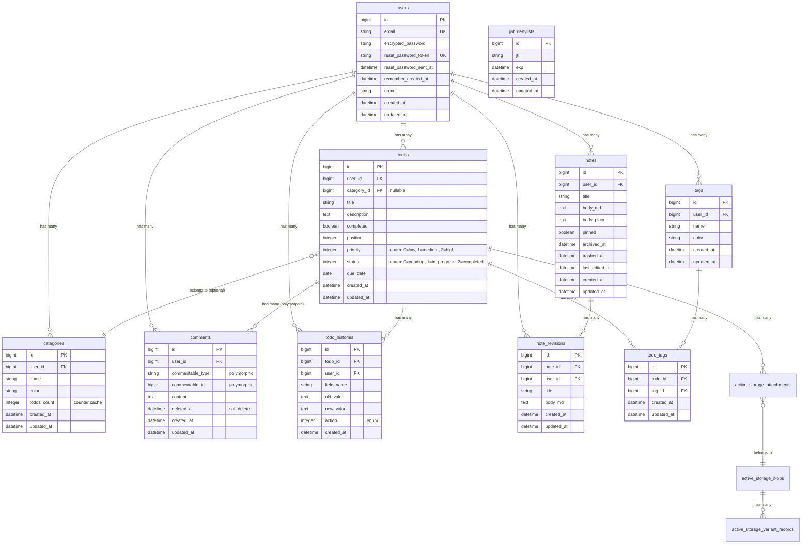

# データベーススキーマ仕様書

## 概要

- **データベース**: PostgreSQL 15
- **文字セット**: UTF-8
- **スキーマバージョン**: 2025_10_17_090001

## ER図



---

## テーブル定義

### users

ユーザー情報を管理するテーブル

| カラム | 型 | NULL | デフォルト | 説明 |
|--------|-----|------|-----------|------|
| id | bigint | NO | auto | 主キー |
| email | string | NO | '' | メールアドレス（ユニーク） |
| encrypted_password | string | NO | '' | 暗号化パスワード（bcrypt） |
| reset_password_token | string | YES | NULL | パスワードリセットトークン |
| reset_password_sent_at | datetime | YES | NULL | トークン送信日時 |
| remember_created_at | datetime | YES | NULL | ログイン記憶日時 |
| name | string | YES | NULL | 表示名 |
| created_at | datetime | NO | NOW | 作成日時 |
| updated_at | datetime | NO | NOW | 更新日時 |

**インデックス**
- `email` (UNIQUE)
- `reset_password_token` (UNIQUE)

---

### todos

タスク情報を管理するテーブル

| カラム | 型 | NULL | デフォルト | 説明 |
|--------|-----|------|-----------|------|
| id | bigint | NO | auto | 主キー |
| user_id | bigint | NO | - | 所有者（FK → users） |
| category_id | bigint | YES | NULL | カテゴリ（FK → categories） |
| title | string | NO | - | タイトル |
| description | text | YES | NULL | 説明 |
| completed | boolean | YES | false | 完了フラグ |
| position | integer | YES | NULL | 並び順 |
| priority | integer | NO | 1 | 優先度（Enum） |
| status | integer | NO | 0 | ステータス（Enum） |
| due_date | date | YES | NULL | 期限日 |
| created_at | datetime | NO | NOW | 作成日時 |
| updated_at | datetime | NO | NOW | 更新日時 |

**Enum: priority**
| 値 | 名前 | 説明 |
|----|------|------|
| 0 | low | 低 |
| 1 | medium | 中（デフォルト） |
| 2 | high | 高 |

**Enum: status**
| 値 | 名前 | 説明 |
|----|------|------|
| 0 | pending | 未着手（デフォルト） |
| 1 | in_progress | 進行中 |
| 2 | completed | 完了 |

**インデックス**
- `user_id`
- `category_id`
- `user_id, category_id`
- `user_id, due_date`
- `user_id, position`
- `user_id, priority`
- `user_id, status`
- `title`
- `description`
- `due_date`
- `position`
- `priority`
- `status`
- `created_at`
- `updated_at`

**外部キー**
- `user_id` → `users.id` (ON DELETE CASCADE)
- `category_id` → `categories.id` (ON DELETE SET NULL)

---

### categories

カテゴリ情報を管理するテーブル

| カラム | 型 | NULL | デフォルト | 説明 |
|--------|-----|------|-----------|------|
| id | bigint | NO | auto | 主キー |
| user_id | bigint | NO | - | 所有者（FK → users） |
| name | string | NO | - | カテゴリ名 |
| color | string | NO | '#6B7280' | カラーコード（HEX） |
| todos_count | integer | NO | 0 | Todo数（カウンターキャッシュ） |
| created_at | datetime | NO | NOW | 作成日時 |
| updated_at | datetime | NO | NOW | 更新日時 |

**インデックス**
- `user_id`
- `user_id, name` (UNIQUE)

**外部キー**
- `user_id` → `users.id` (ON DELETE CASCADE)

---

### tags

タグ情報を管理するテーブル

| カラム | 型 | NULL | デフォルト | 説明 |
|--------|-----|------|-----------|------|
| id | bigint | NO | auto | 主キー |
| user_id | bigint | NO | - | 所有者（FK → users） |
| name | string | NO | - | タグ名 |
| color | string | YES | '#6B7280' | カラーコード（HEX） |
| created_at | datetime | NO | NOW | 作成日時 |
| updated_at | datetime | NO | NOW | 更新日時 |

**インデックス**
- `user_id`
- `user_id, name` (UNIQUE)

**外部キー**
- `user_id` → `users.id` (ON DELETE CASCADE)

---

### todo_tags

Todo-Tag中間テーブル（多対多）

| カラム | 型 | NULL | デフォルト | 説明 |
|--------|-----|------|-----------|------|
| id | bigint | NO | auto | 主キー |
| todo_id | bigint | NO | - | Todo（FK → todos） |
| tag_id | bigint | NO | - | Tag（FK → tags） |
| created_at | datetime | NO | NOW | 作成日時 |
| updated_at | datetime | NO | NOW | 更新日時 |

**インデックス**
- `todo_id`
- `tag_id`
- `todo_id, tag_id` (UNIQUE)

**外部キー**
- `todo_id` → `todos.id` (ON DELETE CASCADE)
- `tag_id` → `tags.id` (ON DELETE CASCADE)

---

### comments

コメント情報を管理するテーブル（ポリモーフィック）

| カラム | 型 | NULL | デフォルト | 説明 |
|--------|-----|------|-----------|------|
| id | bigint | NO | auto | 主キー |
| user_id | bigint | NO | - | 作成者（FK → users） |
| commentable_type | string | NO | - | 関連先モデル名（"Todo"等） |
| commentable_id | bigint | NO | - | 関連先ID |
| content | text | NO | - | コメント本文 |
| deleted_at | datetime | YES | NULL | ソフトデリート日時 |
| created_at | datetime | NO | NOW | 作成日時 |
| updated_at | datetime | NO | NOW | 更新日時 |

**インデックス**
- `user_id`
- `commentable_type, commentable_id`
- `commentable_type, commentable_id, deleted_at`
- `deleted_at`

**外部キー**
- `user_id` → `users.id` (ON DELETE CASCADE)

---

### todo_histories

Todo変更履歴を管理するテーブル

| カラム | 型 | NULL | デフォルト | 説明 |
|--------|-----|------|-----------|------|
| id | bigint | NO | auto | 主キー |
| todo_id | bigint | NO | - | Todo（FK → todos） |
| user_id | bigint | NO | - | 変更者（FK → users） |
| field_name | string | NO | - | 変更フィールド名 |
| old_value | text | YES | NULL | 変更前の値 |
| new_value | text | YES | NULL | 変更後の値 |
| action | integer | NO | 0 | アクションタイプ（Enum） |
| created_at | datetime | NO | NOW | 記録日時 |

**Enum: action**
| 値 | 名前 | 説明 |
|----|------|------|
| 0 | created | 作成 |
| 1 | updated | 更新 |
| 2 | deleted | 削除 |
| 3 | status_changed | ステータス変更 |
| 4 | priority_changed | 優先度変更 |

**インデックス**
- `todo_id`
- `user_id`
- `todo_id, created_at`
- `field_name`

**外部キー**
- `todo_id` → `todos.id` (ON DELETE CASCADE)
- `user_id` → `users.id` (ON DELETE CASCADE)

---

### notes

ノート情報を管理するテーブル

| カラム | 型 | NULL | デフォルト | 説明 |
|--------|-----|------|-----------|------|
| id | bigint | NO | auto | 主キー |
| user_id | bigint | NO | - | 所有者（FK → users） |
| title | varchar(150) | YES | NULL | タイトル |
| body_md | text | YES | NULL | Markdown本文 |
| body_plain | text | YES | NULL | プレーンテキスト（検索用） |
| pinned | boolean | NO | false | ピン留めフラグ |
| archived_at | datetime | YES | NULL | アーカイブ日時 |
| trashed_at | datetime | YES | NULL | ゴミ箱移動日時 |
| last_edited_at | datetime | NO | CURRENT_TIMESTAMP | 最終編集日時 |
| created_at | datetime | NO | NOW | 作成日時 |
| updated_at | datetime | NO | NOW | 更新日時 |

**インデックス**
- `user_id`
- `user_id, archived_at`
- `user_id, trashed_at`
- `user_id, pinned`
- `user_id, last_edited_at`
- `archived_at`
- `trashed_at`
- `pinned`
- `last_edited_at`
- `body_plain`

**外部キー**
- `user_id` → `users.id` (ON DELETE CASCADE)

---

### note_revisions

ノートリビジョン（履歴）を管理するテーブル

| カラム | 型 | NULL | デフォルト | 説明 |
|--------|-----|------|-----------|------|
| id | bigint | NO | auto | 主キー |
| note_id | bigint | NO | - | Note（FK → notes） |
| user_id | bigint | NO | - | 編集者（FK → users） |
| title | varchar(150) | YES | NULL | タイトル |
| body_md | text | YES | NULL | Markdown本文 |
| created_at | datetime | NO | NOW | 作成日時 |
| updated_at | datetime | NO | NOW | 更新日時 |

**インデックス**
- `note_id`
- `user_id`
- `note_id, created_at`

**外部キー**
- `note_id` → `notes.id` (ON DELETE CASCADE)
- `user_id` → `users.id` (ON DELETE CASCADE)

---

### jwt_denylists

無効化されたJWTトークンを管理するテーブル

| カラム | 型 | NULL | デフォルト | 説明 |
|--------|-----|------|-----------|------|
| id | bigint | NO | auto | 主キー |
| jti | string | YES | NULL | JWT ID（トークン識別子） |
| exp | datetime | YES | NULL | トークン有効期限 |
| created_at | datetime | NO | NOW | 作成日時 |
| updated_at | datetime | NO | NOW | 更新日時 |

**インデックス**
- `jti`

---

### active_storage_blobs

Active Storage ファイルメタデータ

| カラム | 型 | NULL | デフォルト | 説明 |
|--------|-----|------|-----------|------|
| id | bigint | NO | auto | 主キー |
| key | string | NO | - | ストレージキー |
| filename | string | NO | - | ファイル名 |
| content_type | string | YES | NULL | MIMEタイプ |
| metadata | text | YES | NULL | メタデータ（JSON） |
| service_name | string | NO | - | ストレージサービス名 |
| byte_size | bigint | NO | - | ファイルサイズ（バイト） |
| checksum | string | YES | NULL | チェックサム |
| created_at | datetime | NO | NOW | 作成日時 |

**インデックス**
- `key` (UNIQUE)

---

### active_storage_attachments

Active Storage 関連付け

| カラム | 型 | NULL | デフォルト | 説明 |
|--------|-----|------|-----------|------|
| id | bigint | NO | auto | 主キー |
| name | string | NO | - | 関連名（"files"等） |
| record_type | string | NO | - | 関連先モデル名 |
| record_id | bigint | NO | - | 関連先ID |
| blob_id | bigint | NO | - | Blob（FK → active_storage_blobs） |
| created_at | datetime | NO | NOW | 作成日時 |

**インデックス**
- `blob_id`
- `record_type, record_id, name, blob_id` (UNIQUE)

**外部キー**
- `blob_id` → `active_storage_blobs.id` (ON DELETE CASCADE)

---

### active_storage_variant_records

Active Storage バリアント（リサイズ画像等）

| カラム | 型 | NULL | デフォルト | 説明 |
|--------|-----|------|-----------|------|
| id | bigint | NO | auto | 主キー |
| blob_id | bigint | NO | - | Blob（FK → active_storage_blobs） |
| variation_digest | string | NO | - | バリアントダイジェスト |

**インデックス**
- `blob_id, variation_digest` (UNIQUE)

**外部キー**
- `blob_id` → `active_storage_blobs.id` (ON DELETE CASCADE)

---

## 外部キー制約一覧

| テーブル | カラム | 参照先 | ON DELETE |
|---------|--------|--------|-----------|
| categories | user_id | users.id | CASCADE |
| todos | user_id | users.id | CASCADE |
| todos | category_id | categories.id | SET NULL |
| tags | user_id | users.id | CASCADE |
| todo_tags | todo_id | todos.id | CASCADE |
| todo_tags | tag_id | tags.id | CASCADE |
| comments | user_id | users.id | CASCADE |
| todo_histories | todo_id | todos.id | CASCADE |
| todo_histories | user_id | users.id | CASCADE |
| notes | user_id | users.id | CASCADE |
| note_revisions | note_id | notes.id | CASCADE |
| note_revisions | user_id | users.id | CASCADE |
| active_storage_attachments | blob_id | active_storage_blobs.id | CASCADE |
| active_storage_variant_records | blob_id | active_storage_blobs.id | CASCADE |

---

## PostgreSQL拡張機能

```sql
-- 必要な拡張機能
CREATE EXTENSION IF NOT EXISTS "pg_catalog.plpgsql";
```

---

## マイグレーション実行順序

移行先で新規DBを作成する場合、以下の順序でテーブルを作成：

1. `users`
2. `jwt_denylists`
3. `categories`
4. `tags`
5. `todos`
6. `todo_tags`
7. `comments`
8. `todo_histories`
9. `notes`
10. `note_revisions`
11. `active_storage_blobs`
12. `active_storage_attachments`
13. `active_storage_variant_records`
